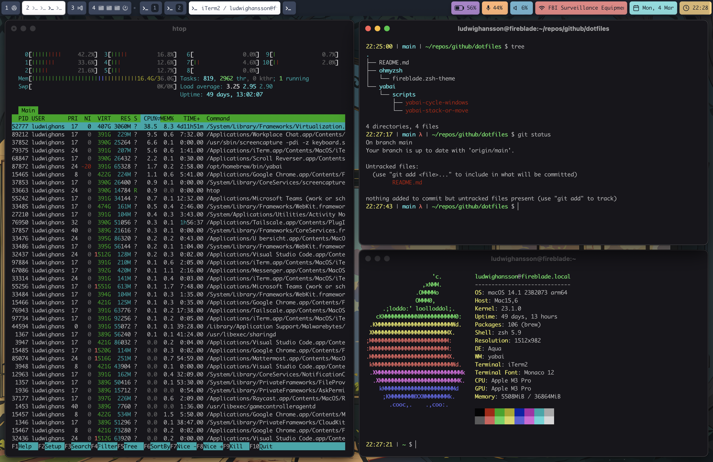
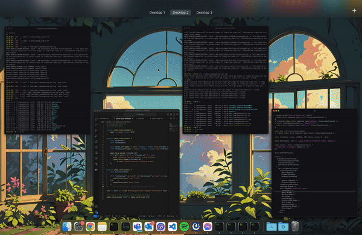

# Dotfiles
Configuration files for my "i3wm wannabe", riced yabai macbook. This is with SIP (System Integrity Protection) enabled, thus limiting Yabai somewhat, but not nearly as much as one might think.

## Dependencies
* yabai
* skhd
* iTerm2
* übersicht
* simple-bar
* raycast

## Yabai Functionality
* i3wm stacked window movement - This is something I loved with i3wm, having the possibility to run multiple instances of apps in a stack and being able to quickly switch between them. I tried to replicate this as much as I could to i3wm, and in my opinion it works just as well (if not better) than i3wm.
  * Move window ontop of another - if a window is moved ontop of an exsiting stack, the target window gets injected into it, or if it doesn't exists one is created.
  * Move window out from stack - easily move the active windows in and out from it's stack. Moving the most leftwards window to the most rightward position means the active window will create stacks with any windows it crosses on its way there.
* Window Cycling - Support cycling through both stacks and standard managed windows

### Keybindings
I choosed "right cmd" as my mod key, as I hadn't used it more than once or twice before, and having one key as mod key make the experience 100x times better IMO.

### Window and space movement
* `rcmd - [AD]` - cycle between windows in the same space forward or backwards
* `rcmd - [0-9]` - Set focus on space N (requires the target space has at least one active window)
* `shift + rcmd - [WASD]` - move window up, left, down, right in the same space
* `shift + rcmd - [0-9]` - send window to another space (requires the target space to exist)
* `rcmd - f` - toggle fullscreen for focused window (NOTE! not native fullscreen)
* `rcmd - v` - toggle split mode for current window (horizontal/vertical)
* `rcmd - g` - toggle float for window (i.e. make it unmanaged)
* `rcmd - b` - re-balance all windows in the current space

### Layouts
* `rcmd - c` - set layout for current space to `stack`
* `rcmd - z` - set layout for current space to `bsp`
* `rcmd - x` - set layout for current space to `float` (i.e. unmanaged space)
  
### Gaps
* `rcmd - p` - toggle gaps and padding on/off

# Screenshots

## Split stacking focus movement
Move focus around the stacked windows with `mod - [WASD]`. When moving "out of scope", the stack is looped. `mod - d` moves to the rightmost stack, pressing `mod - d` again will perform a `--focus stack.next` until the stack has been looped through entirely, then invoking `--focus stack.first` to continue the loop.
If there are no surronding windows positioned above or beneath the active window, `mod - w` and `mod - s` can be used to orient the stack back and forth, instead of only one direction

